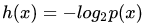
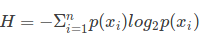

#### [决策树相关](https://blog.csdn.net/jiaoyangwm/article/details/79525237#%E5%86%B3%E7%AD%96%E6%A0%91)
##### 名词解释
1. 适用数据类型:　标称型和数值型
2. 信息量: 衡量信息大小, 和事件发生的概率成反比. 
3. 香农熵: 简称熵,信息的度量方式, 描述信息的不确定性.  
4. 经验熵: 熵中的概率有数据估计(最大似然估计)得到时, 所对应的熵成为经验熵
