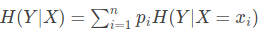
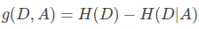

#### [决策树相关](https://blog.csdn.net/jiaoyangwm/article/details/79525237#%E5%86%B3%E7%AD%96%E6%A0%91)

##### 实现决策树算法整体流程
1. 构造决策树(编码计算经验熵, 计算信息增益)
2. 决策树的生成和剪枝(ID3算法, C4.5算法, CART算法)
3. 使用决策树分类, 存储

##### ID3算法(用极大似然法进行概率模型的选择)
解释: ID3算法的核心是在决策树各个结点上对应**信息增益**准则选择特征，递归地构建决策树。

方法: 

    1. 从根结点(root node)开始，对结点计算所有可能的特征的信息增益，选择信息增益最大的特征作为结点的特征
    2. 由该特征的不同取值建立子节点，再对子结点递归地调用以上方法，构建决策树；直到所有特征的信息增益均很小或没有特征可以选择为止
    3. 最后得到一个决策树
    
##### C4.5算法(用极大似然法进行概率模型的选择)
解释: ID3算法相比ID3算法,区别是选取**信息增益比**作为特征选择的标准

##### 名词解释
1. 适用数据类型:　标称型和数值型
2. 信息量: 衡量信息大小, 和事件发生的概率成反比. 
3. 香农熵: 简称熵,信息的度量方式, 描述信息的不确定性.  
4. 经验熵: 熵中的概率有数据估计(最大似然估计)得到时, 所对应的熵成为经验熵
5. 信息增益: 在一个特征条件下, 信息不确定性减少的程度
6. 条件熵H(Y|X)表示在已知随机变量X的条件下随机变量Y的不确定性. 
7. 特征A对训练数据集D的信息增益g(D,A)，定义为集合D的经验熵H(D)与特征A给定条件下D的经验条件熵H(D|A)之差.  
